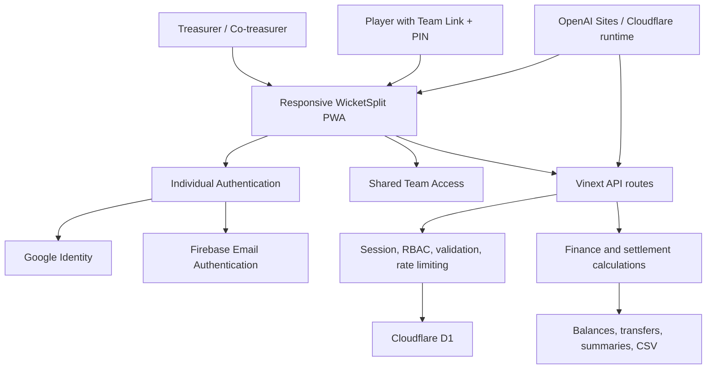
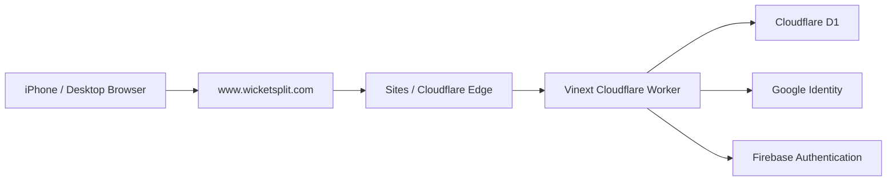
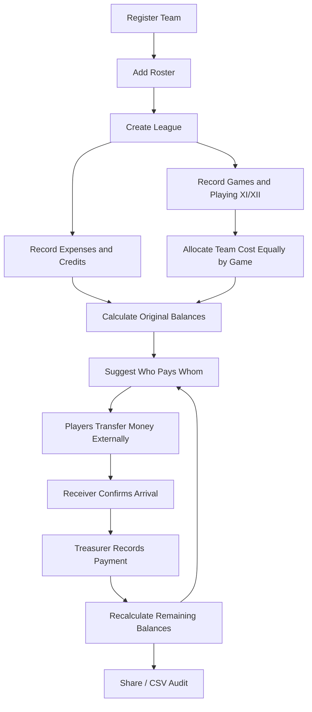

# WicketSplit High-Level Design

## Purpose

WicketSplit is a multi-team expense and settlement tracker for recreational
cricket teams. It records team costs, calculates fair player shares, suggests
who should pay whom, and tracks confirmed repayments. It does not move money.

## Scope

The product supports:

- Multiple teams, shared rosters, leagues, and treasurers
- Games with Playing XI or XII selection
- Per-game fair-split eligibility independent of recorded lineup membership
- Equal-per-game team-cost allocation followed by an eligible-player split
- Per-game calculation breakdown and custom-player expense splits
- One league fee plus Fruits / Water, IV, and umpiring-credit funding in the
  game-funded cost pool
- Team-funded player credits
- Confirmed settlement-payment history
- Individually authenticated treasurer and co-treasurer access
- Registration-free early-access requests followed by email-bound,
  administrator-approved signup links for brand-new team owners
- Registration-free player access through one revocable team link and PIN
- Google and Firebase email authentication for treasurers
- Mobile/PWA usage, shareable summaries, and CSV exports
- Public production access through `https://www.wicketsplit.com`, with Sites
  custom-domain TLS and DNS validation

Scoring, statistics, brackets, chat, bookings, merchandise, and payment
processing are outside the current scope.

## System context

## Major components

| Component | Responsibility |
|---|---|
| Responsive web application | Team, league, roster, expense, and settlement UI |
| Authentication | Google OAuth and verified Firebase email identity for treasurers |
| Session layer | Signed, secure authentication cookie |
| Access-control layer | Server-enforced owner, treasurer, and member permissions |
| Team users administration | Treasurer-only combined view of authenticated treasurers, shared-link player sessions, and pending invitations |
| Shared member access | Hashed link/PIN verification, roster identity selection, and revocation |
| Workspace API | Loads, validates, authorizes, and saves team state |
| Invitation API | Issues expiring, single-use co-treasurer invitations |
| Query/index layer | Indexed membership, role, player-link, invitation, and expiry lookups |
| Finance engine | Expense shares, credits, balances, and transfer suggestions |
| Settlement ledger | Transparent fair share, expenses paid, umpiring credits, confirmed payments, and remaining-balance calculation |
| Export layer | Shareable settlement summary and CSV audit output |
| Cloudflare D1 | Accounts, teams, memberships, invitations, and rate counters |

## Deployment architecture

The frontend and server routes are deployed as one Cloudflare-compatible
Vinext application. `www.wicketsplit.com` is the canonical production origin;
the zone apex is attached separately and becomes usable when its managed TLS
certificate is active. Firebase and Google OAuth must authorize both origins.

## Access model

- **Original treasurer:** full management and team deletion.
- **Co-treasurer:** full operational management.
- **Player:** no registration; enters through the private team link and PIN,
  selects a roster identity, and can view limited team records and a private
  player breakdown. Shared sessions are restricted to the linked team, cannot
  add new expenses, and cannot create another team. Compatibility rules may
  still permit correction or deletion of an older expense previously submitted
  by that same shared identity.

All permissions are enforced by the server. UI visibility is not authorization.
Treasurers may revoke another co-treasurer's membership while preserving the
roster player and all historical records. The original owner and the requester's
own active membership are protected from this operation.

## Primary workflow

## Finance invariants

- League Fee, Fruits / Water, IV, and full umpiring credits form the game-funded
  cost pool. Each cost is divided equally across completed games with eligible
  players, then each game's portion is divided among that game's eligible
  players. A player's share is the sum of their per-game shares.
- All selected lineup players are eligible by default. Exclusions retain game
  history but remove that player only from the affected game's cost division.
- Restaurant and Other expenses use either the by-game calculation or explicit
  custom players.
- Every umpire receives the full games-times-rate credit even when it exceeds
  what they otherwise owe; the full credit is also funded through the team pool.
- Confirmed repayments are separate from expenses and credits.
- A confirmed payment increases the sender's balance and decreases the
  receiver's balance.
- Payment amounts cannot exceed both the sender's remaining debt and the
  receiver's amount due.
- Financially referenced players cannot be silently deleted.

## Security architecture

- Google and Firebase identity tokens are verified server-side.
- Sessions use HMAC-signed `HttpOnly`, `Secure`, `SameSite=Lax` cookies.
- Mutation routes reject invalid origins.
- Team roles are loaded from D1 memberships.
- Payload size, data shape, IDs, references, dates, amounts, and string lengths
  are validated.
- Destructive and authentication operations are throttled.
- Invitation tokens are random, hashed, single-use, and expiring.
- Shared team-link tokens and PINs are verified with one-way hashes; the
  reusable invitation is encrypted at rest with an application-derived key.
- Replacing or revoking shared access invalidates existing player sessions.
- Shared-entry attempts are throttled by IP and token hash.
- Production secrets remain in the Sites runtime environment.
- Google OAuth Authorized JavaScript Origins and Firebase authorized domains
  include both official hostnames; OAuth failures are treated as configuration
  errors rather than retried as application failures.

## Current scale and limitations

The current application stores team structure and each player, league, game,
expense, credit, and payment as indexed D1 records. Existing JSON teams migrate
on first load; a synchronized JSON snapshot remains temporarily for rollback
and compatibility with invitation/access routes.

- Workspace requests are limited to 256 KB.
- Enforced maxima are 50 teams/account, 500 players/team, 100 leagues/team,
  1,000 games/league, and 10,000 entries of each financial type/league, but the
  payload limit is expected to be reached first.
- Optimistic team versions reject stale concurrent writes and direct the user
  to reload the latest revision.
- Game history is paginated in groups of 12 and the finance ledger in groups of
  20 after filtering. Pagination is currently client-side because each team is
  is still returned through one validated account response.
- The client still submits a validated full-workspace request, and the server
  rewrites that team's record set atomically. Record-specific mutation APIs are
  the next optimization.
- There is no payment-provider integration or automatic reconciliation.

The present model is appropriate for a controlled recreational-team beta. A
reasonable untested operating target is tens of teams and hundreds to low
thousands of players; it is not a load-tested service-level guarantee. See
`FUTURE_TODO.md` for the ordered path to normalized record-level persistence,
record-specific writes, server pagination, monitoring, and backups.
