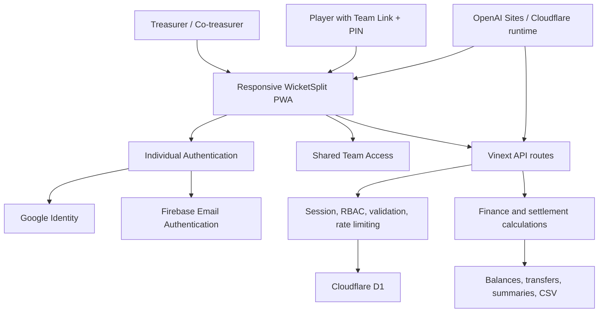
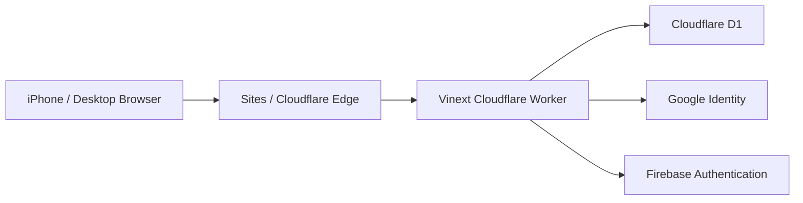
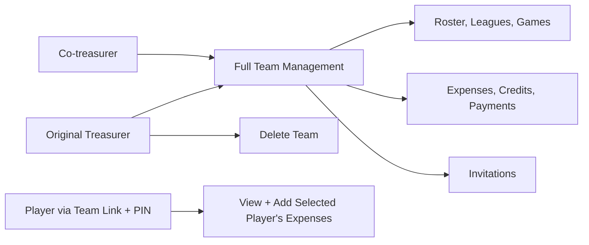
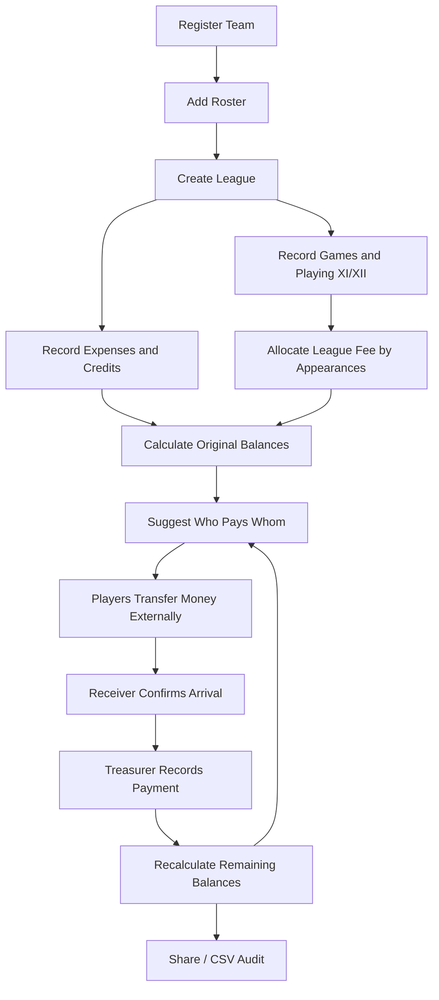

# WicketSplit High-Level Design

## Purpose

WicketSplit is a multi-team expense and settlement tracker for recreational
cricket teams. It records team costs, calculates fair player shares, suggests
who should pay whom, and tracks confirmed repayments. It does not move money.

## Scope

The product supports:

- Multiple teams, shared rosters, leagues, and treasurers
- Games with Playing XI or XII selection
- Per-game fair-split eligibility independent of recorded lineup membership
- Game-lineup and custom-player expense splits
- One league fee allocated by completed-game appearances
- Player credits and waivers
- Confirmed settlement-payment history
- Individually authenticated treasurer and co-treasurer access
- Registration-free player access through one revocable team link and PIN
- Google and Firebase email authentication for treasurers
- Mobile/PWA usage, shareable summaries, and CSV exports

Scoring, statistics, brackets, chat, bookings, merchandise, and payment
processing are outside the current scope.

## System context

## Major components

| Component | Responsibility |
|---|---|
| Responsive web application | Team, league, roster, expense, and settlement UI |
| Authentication | Google OAuth and verified Firebase email identity for treasurers |
| Session layer | Signed, secure authentication cookie |
| Access-control layer | Server-enforced owner, treasurer, and member permissions |
| Shared member access | Hashed link/PIN verification, roster identity selection, and revocation |
| Workspace API | Loads, validates, authorizes, and saves team state |
| Invitation API | Issues expiring, single-use co-treasurer invitations |
| Finance engine | Expense shares, credits, balances, and transfer suggestions |
| Settlement ledger | Confirmed payments and remaining-balance calculation |
| Export layer | Shareable settlement summary and CSV audit output |
| Cloudflare D1 | Accounts, teams, memberships, invitations, and rate counters |

## Deployment architecture

The frontend and server routes are deployed as one Cloudflare-compatible
Vinext application.

## Access model

- **Original treasurer:** full management and team deletion.
- **Co-treasurer:** full operational management.
- **Player:** no registration; enters through the private team link and PIN,
  selects a roster identity, and can view records, submit expenses paid by that
  player, and edit or delete only entries from that shared identity. Shared
  sessions are restricted to the linked team and cannot create another team.

All permissions are enforced by the server. UI visibility is not authorization.
Treasurers may revoke another co-treasurer's membership while preserving the
roster player and all historical records. The original owner and the requester's
own active membership are protected from this operation.

## Primary workflow

## Finance invariants

- A league fee is split by eligible completed-game appearances. All selected
  players are eligible by default; exclusions retain game history but carry no
  weight in appearance-based costs.
- Other expenses are split only among a selected game lineup or custom players.
- Credits remain explainable and identify who receives and funds them.
- Confirmed repayments are separate from expenses and credits.
- A confirmed payment increases the sender's balance and decreases the
  receiver's balance.
- Payment amounts cannot exceed both the sender's remaining debt and the
  receiver's amount due.
- Financially referenced players cannot be silently deleted.

## Security architecture

- Google and Firebase identity tokens are verified server-side.
- Sessions use HMAC-signed `HttpOnly`, `Secure`, `SameSite=Lax` cookies.
- Mutation routes reject invalid origins.
- Team roles are loaded from D1 memberships.
- Payload size, data shape, IDs, references, dates, amounts, and string lengths
  are validated.
- Destructive and authentication operations are throttled.
- Invitation tokens are random, hashed, single-use, and expiring.
- Shared team-link tokens and PINs are verified with one-way hashes; the
  reusable invitation is encrypted at rest with an application-derived key.
- Replacing or revoking shared access invalidates existing player sessions.
- Shared-entry attempts are throttled by IP and token hash.
- Production secrets remain in the Sites runtime environment.

## Current scale and limitations

The current application stores each shared team as a JSON workspace and saves
the complete accessible account state on update. This is appropriate for
recreational teams and early production feedback, but it has limitations:

- Workspace requests are limited to 256 KB.
- Concurrent workspace changes use last-write-wins.
- Long histories are not paginated.
- Games, expenses, credits, and repayments are not separate relational rows.
- There is no payment-provider integration or automatic reconciliation.

The next scaling step is normalized record-level persistence with transactions,
optimistic version checks, pagination, indexes, monitoring, and backups.
