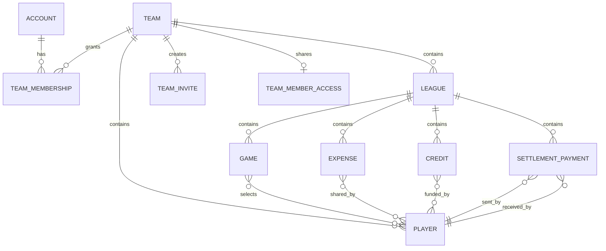
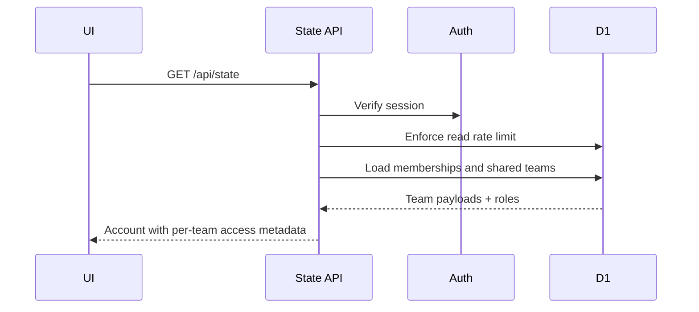
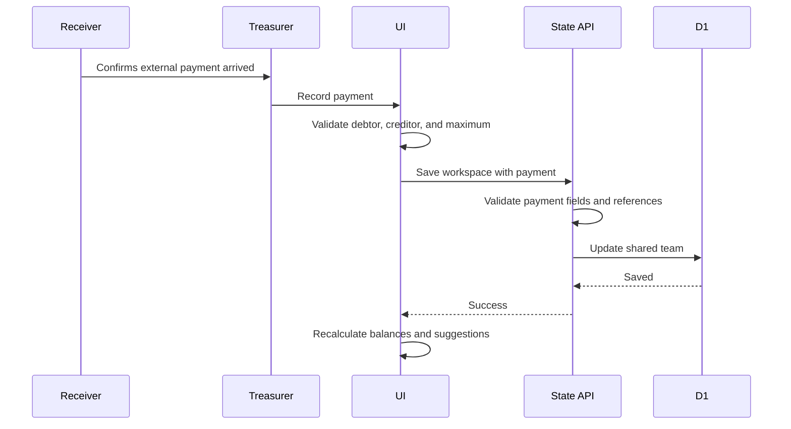

# WicketSplit Low-Level Design

## Technology stack

- Vinext and React
- TypeScript
- Cloudflare Worker runtime
- Cloudflare D1
- Google Identity
- Firebase email authentication
- OpenAI Sites hosting
- Responsive PWA assets and service worker

## Source layout

| Location | Responsibility |
|---|---|
| `app/dashboard.tsx` | Main UI, finance calculations, settlement logic, CSV |
| `app/api/state/route.ts` | Workspace reads, validation, authorization, writes |
| `app/api/invites/route.ts` | Invitation creation |
| `app/api/invites/accept/route.ts` | Invitation acceptance |
| `app/api/team-access/route.ts` | Create, replace, or revoke shared player access |
| `app/api/team-access/join/route.ts` | Verify PIN, select roster identity, create member session |
| `app/api/team-treasurers/route.ts` | List roles and revoke co-treasurer membership |
| `app/join-team/page.tsx` | Registration-free team member entry UI |
| `app/api/players/route.ts` | Protected roster deletion |
| `app/api/teams/route.ts` | Owner-only team deletion |
| `app/api/auth/*` | Google, Firebase, session, and logout routes |
| `app/api/security.ts` | Shared origin and rate-limit helpers |
| `app/google-auth.ts` | Identity verification and signed sessions |
| `app/globals.css` | Desktop, mobile, modal, table, and PWA styling |
| `drizzle/` | D1 migrations |

## Core domain types

```ts
type Player = {
  id: number;
  name: string;
  initials: string;
  email?: string;
  phone?: string;
  color: string;
};

type Game = {
  id: number;
  date: string;
  opponent: string;
  venue: string;
  players: number[];
  excludedFromSplit?: number[];
  status: "Upcoming" | "Completed";
};

type Expense = {
  id: number;
  date: string;
  label: string;
  category: string;
  amount: number;
  paidBy: number;
  gameId?: number;
  split: "players" | "custom" | "appearances";
  participants?: number[];
  submittedBy?: string;
};

type Credit = {
  id: number;
  date: string;
  label: string;
  amount: number;
  playerId: number;
  gameId?: number;
  split: "players" | "custom";
  participants: number[];
};

type SettlementPayment = {
  id: number;
  date: string;
  fromPlayerId: number;
  toPlayerId: number;
  amount: number;
  note?: string;
  recordedBy?: string;
};

type League = {
  id: number;
  name: string;
  season: string;
  status: "Active" | "Completed";
  games: Game[];
  expenses: Expense[];
  credits?: Credit[];
  payments?: SettlementPayment[];
};

type Team = {
  id: number;
  name: string;
  sport: string;
  players: Player[];
  leagues: League[];
  access?: {
    role: "treasurer" | "member";
    playerId?: number | null;
    isOwner?: boolean;
  };
};
```

Optional `credits` and `payments` preserve compatibility with workspaces saved
before those features existed.

## Logical relationships



## D1 tables

### `app_states`

| Column | Purpose |
|---|---|
| `team_key` | Account identity key |
| `payload` | Account-level JSON |
| `updated_at` | Last update timestamp |

### `shared_teams`

| Column | Purpose |
|---|---|
| `team_id` | Shared team primary key |
| `payload` | Team workspace JSON |
| `updated_at` | Last update timestamp |

### `team_memberships`

| Column | Purpose |
|---|---|
| `team_id` | Team reference |
| `email` | Verified identity |
| `role` | `treasurer` or `member` |
| `player_id` | Optional roster connection |
| `joined_at` | Join timestamp |

Primary key: `(team_id, email)`.

### `team_invites`

Stores the token hash, team, player, invitation role, creator, intended email,
expiry, and acceptance information.

### `team_member_access`

| Column | Purpose |
|---|---|
| `team_id` | One shared-access record per team |
| `token_hash` | SHA-256 hash of the private link token |
| `pin_hash` | SHA-256 hash derived from the token and six-digit PIN |
| `created_by` | Treasurer who created or replaced access |
| `created_at` | Creation timestamp |
| `access_secret` | AES-GCM encrypted reusable token and PIN |

### `api_rate_limits`

Stores rolling request counters by rate key and time window.

## API contracts

| Method | Route | Authorization | Purpose |
|---|---|---|---|
| `GET` | `/api/state` | Signed-in user | Load accessible teams |
| `POST` | `/api/state` | Member or treasurer, field-specific | Validate and save state |
| `POST` | `/api/invites` | Treasurer | Create invitation |
| `POST` | `/api/invites/accept` | Signed-in invitee | Accept invitation |
| `POST` | `/api/team-access` | Treasurer | Create or replace team link and PIN |
| `DELETE` | `/api/team-access` | Treasurer | Revoke shared player access |
| `POST` | `/api/team-access/join` | Public, throttled | Verify PIN or select roster identity |
| `GET` | `/api/team-treasurers` | Treasurer | List owner and co-treasurer access |
| `DELETE` | `/api/team-treasurers` | Treasurer | Remove another co-treasurer's access |
| `DELETE` | `/api/players` | Treasurer | Delete unused player |
| `DELETE` | `/api/teams` | Original treasurer | Delete shared team |
| `DELETE` | `/api/account` | Signed-in user | Delete account data |
| `POST` | `/api/auth/google` | Public, throttled | Verify Google sign-in |
| `POST` | `/api/auth/email` | Public, throttled | Verify Firebase sign-in |
| `GET` | `/api/auth/logout` | Session | Clear session |

## Workspace read flow



Legacy account-owned teams are migrated into `shared_teams` and
`team_memberships` when state is read.

## Workspace write flow

1. Reject cross-origin mutation requests.
2. Verify the signed session.
3. Enforce the 256 KB payload limit.
4. Apply the account write-rate limit.
5. Parse and structurally validate the complete state.
6. Load membership for each incoming team.
7. For a treasurer, update the shared team payload.
8. For a member:
   - Require the submitted workspace to contain exactly the session's team.
   - Reject setup, game, credit, and payment changes.
   - Accept new expenses only when the payer is the member's linked player.
   - Accept edits or deletions only when the stored `submittedBy` matches the
     verified session identity; edited entries must retain the linked payer.
   - Stamp the verified submitter email.

Current workspace writes are last-write-wins.

## Shared team member flow

1. A treasurer creates one team link and six-digit PIN.
2. The server stores verification hashes plus an AES-GCM encrypted copy used
   to show treasurers the same reusable invitation on later visits.
3. A player opens `/join-team?token=...`, enters the PIN, and receives the
   alphabetized roster.
4. The player selects their roster identity. The server creates a synthetic
   member membership tied to that player and a signed `HttpOnly` session.
5. Creating access again reuses the existing invitation. Only an explicit
   replacement rotates it. Every shared-session request rechecks the team's
   current token hash, so replacing or revoking access immediately signs out
   prior shared sessions.
6. State writes apply the member policy: read team records, add expenses whose
   payer is the selected player, and edit or delete only that identity's own
   submitted expenses.

## Finance calculations

### Custom or game split

```text
player share = expense amount / participant count
```

The share applies only when the player is in the custom selection or referenced
game lineup.

### Game-funded team costs

```text
cost per completed game =
  total game-funded team costs / completed games with eligible players

player game share =
  cost per completed game / eligible players in that game

player total game-funded share =
  sum of player game shares for every eligible game they played
```

The Calculator and CSV expose this same calculation as a per-game view:

```text
game allocated cost =
  total game-funded team costs / completed games with eligible players

game cost per payer =
  game allocated cost / game eligible payer count
```

Consequently, every completed game receives the same cost, while its cost per
payer changes with that game’s eligible lineup size.

The game form selects the Playing XI/XII once. Every selected player is
eligible by default, with exclusions hidden behind an optional adjustment.
Game-funded expense forms do not repeat lineup or participant selection;
creating or editing a completed lineup recalculates these shares.

`excludedFromSplit` is optional for backward compatibility, contains only
unique IDs from the same game lineup, and cannot exclude the entire lineup.
Exclusion affects League Fee and Fruits / Water calculations only. It does not
remove the player from game history or alter custom participant expenses.

### Original balance

Umpiring is stored using the legacy `umpiring-waiver` kind for backward
compatibility, but its accounting behavior is a funded credit:

```text
player umpiring credit = games umpired * fixed rate

player umpiring cost share =
  sum((total umpiring credits / completed games)
      / eligible players in each game the player played)
```

The full credit is added to its recipient. That full credited amount is also
added to the team cost pool, divided equally across completed games, and then
included in each game’s eligible players’ fair shares. This keeps total balances
at zero and allows an umpire to finish with money to receive.

```text
original balance =
  expenses paid
  + credits received
  - expense shares
  - funded credit shares
```

### Remaining balance

```text
remaining balance =
  original balance
  + confirmed payments sent
  - confirmed payments received
```

Negative means the player owes money. Positive means the player should receive
money.

## Transfer minimization

`settlementTransfers`:

1. Creates debtors from negative remaining balances.
2. Creates creditors from positive remaining balances.
3. Matches the first debtor and creditor.
4. Uses the smaller remaining amount as the transfer.
5. Reduces both values and advances fully resolved entries.
6. Continues until either list is empty.

The returned suggestion contains sender and receiver IDs, display names, and
the amount.

## Confirmed-payment flow



The payment form:

- Offers current transfer suggestions.
- Allows only players who currently owe as senders.
- Allows only players currently due money as receivers.
- Limits the amount to both remaining positions.
- Records the received date and optional reference.
- Stamps the recorder's verified email.

Only treasurers can add or delete payments. Deleting a mistaken record restores
the prior balances. Referenced players cannot be deleted.

## Invitation flow

1. Treasurer chooses member or co-treasurer.
2. API verifies role and player reference.
3. API generates a 256-bit random token.
4. Only its SHA-256 hash is stored.
5. The UI displays the exact invitation message for manual copying.
6. Invitee signs in and accepts the link.
7. API validates hash, expiration, unused status, role, and intended email.
8. Membership is created and the invitation is consumed.

Co-treasurer invitations require an email-bound roster player.

## Validation rules

The state API validates:

- At most 50 teams per account
- At most 500 players and 100 leagues per team
- At most 1,000 games per league
- At most 10,000 expenses, credits, or payments per league
- Unique positive integer IDs
- Valid dates and supported statuses
- Positive finite amounts no greater than 100,000,000
- Existing player and game references
- Unique, non-empty participant lists
- Different settlement sender and receiver
- Bounded strings and optional contact fields

The request payload limit is 256 KB, which is the practical limit before the
individual collection limits.

## Deletion protections

- A roster player cannot be deleted while referenced by team access, games,
  expenses, credits, participant lists, or settlement payments.
- A game cannot be deleted while directly referenced by an expense or credit.
- Expense and payment deletion requires confirmation and recalculates balances.
- Only the original treasurer can delete an entire team.

## Rate limits

| Operation | Limit |
|---|---|
| State reads | 120/minute/account |
| State writes | 40/minute/account |
| Google login | 20/minute/IP |
| Email login | 10/minute/IP |
| Invite creation | 20/hour/account and 60/hour/IP |
| Invite acceptance | 20/minute/account and 30/minute/IP |
| Account deletion | 3/hour/account |

## Export design

The CSV contains:

- Team, league, and season
- Player settlement with cash paid, credits, fair share, sent, received, and
  remaining balance
- Current suggested transfers
- Confirmed payment history
- Expense details
- Team-funded credit details

Cells beginning with spreadsheet formula characters are prefixed to prevent CSV
formula injection.

## Known constraints and next design

Current constraints:

- Full-workspace JSON saves
- Last-write-wins concurrency
- No record pagination
- No immutable database-level financial audit log
- No automated bank reconciliation
- A successful login still depends on Firebase/Google authentication throttles;
  repeated password attempts can temporarily block a device independently of
  WicketSplit's own 60-second API windows.

Recommended next design:

- Normalize teams, leagues, games, expenses, participants, credits, and payments
  into separate tables.
- Add D1 transactions and optimistic version checks.
- Add record-level APIs, pagination, and indexes.
- Add immutable audit events, backups, metrics, and alerts.
- See `FUTURE_TODO.md` for priority, acceptance criteria, and deferred scope.
